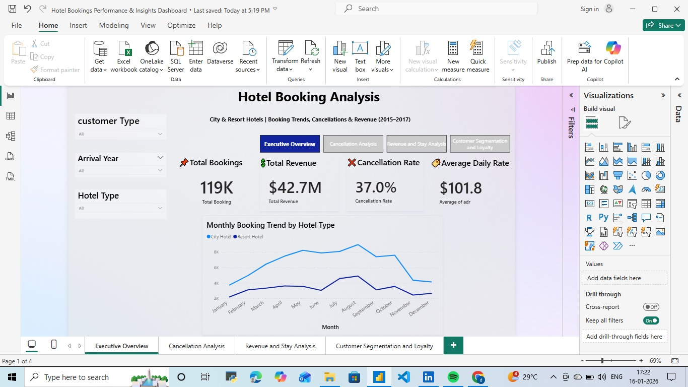
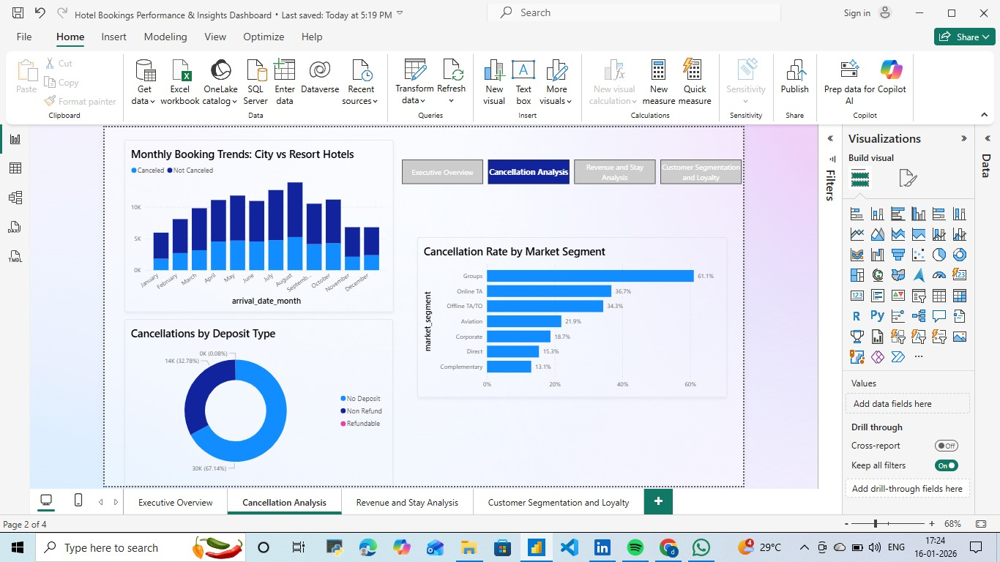
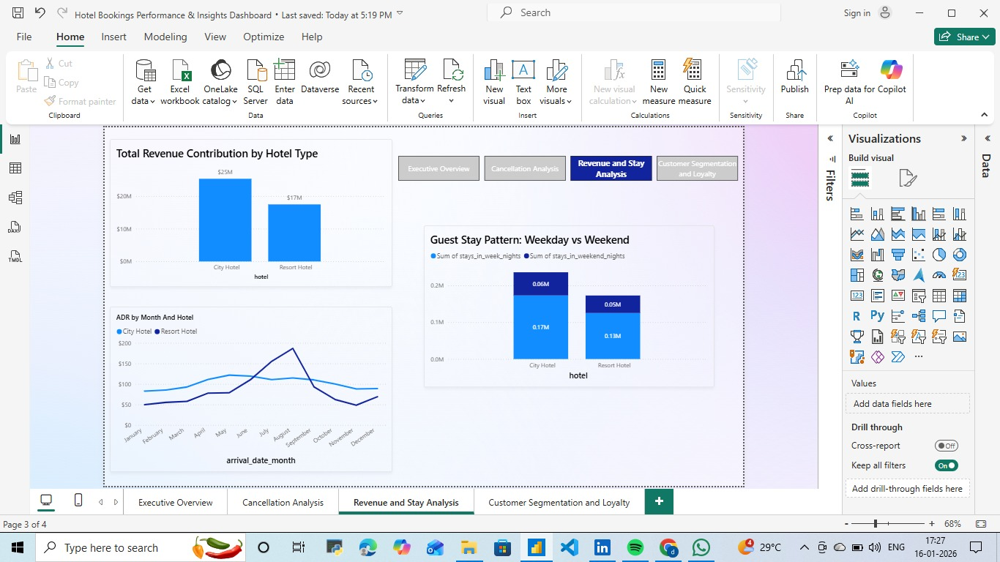
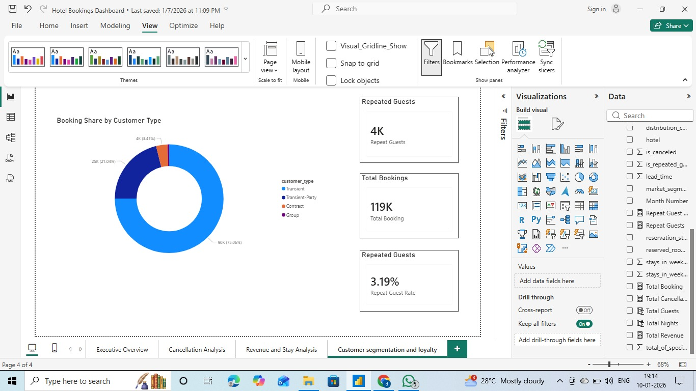

# Hotel Booking Analysis

## Problem Statement
Hotels face revenue loss due to high booking cancellations. This project analyzes booking patterns to identify cancellation trends.

## Dataset
Hotel booking dataset (2015–2017) containing booking status, customer type, and seasonal details.

## Tools Used
- Power BI
- Excel
- SQL

## Steps Performed
- Cleaned missing and incorrect values
- Created calculated measures using DAX
- Built interactive dashboards

## Key Insights
- Cancellations are higher during peak seasons
- Online bookings have higher cancellation rates

## Business Impact
Helps hotel management reduce cancellations and improve booking strategies.

## Dashboard
Power BI Public Link: (paste your link here)
## Dashboard Screenshots

### 1. Executive Overview

### 2. Cancellation Analysis

### 3. Revenue and Stay Analysis

### 4. Customer Segmentation and Loyalty

